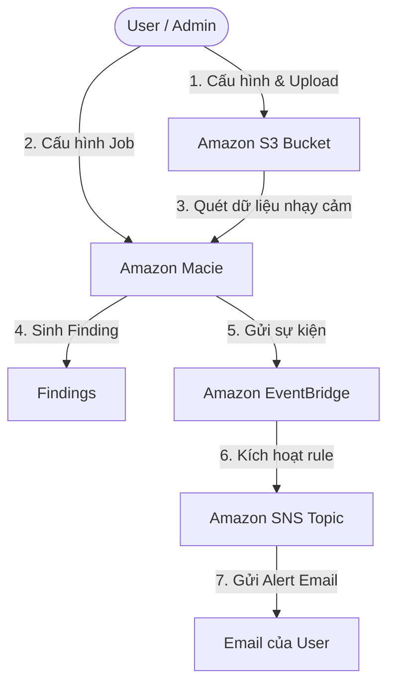

# Hướng Dẫn: Phát Hiện Dữ Liệu Nhạy Cảm Trên Amazon S3 Bằng Amazon Macie & Gửi Thông Báo Tự Động

Tài liệu này phân tích yêu cầu kiến trúc và cung cấp hướng dẫn cấu hình từng bước để xây dựng hệ thống tự động quét dữ liệu nhạy cảm (PII, thông tin thẻ tín dụng, v.v.) trên Amazon S3 bằng **Amazon Macie**, sau đó gửi cảnh báo qua email thông qua **Amazon EventBridge** và **Amazon SNS**.

---

## I. Phân Tích Kiến Trúc Hệ Thống (Architecture Analysis)

Dựa trên sơ đồ luồng dữ liệu (Data Flow Diagram):



### Các thành phần chính và vai trò:
1. **Amazon S3 Bucket**: Nơi lưu trữ các tệp tin (tài liệu, ảnh, CSV, log...). Đây là đối tượng cần giám sát và quét mã độc/dữ liệu nhạy cảm.
2. **Amazon Macie**: Dịch vụ bảo mật dữ liệu sử dụng học máy và khớp mẫu để tự động phát hiện, phân loại và bảo vệ dữ liệu nhạy cảm (như thông tin cá nhân PII - số định danh, thẻ tín dụng, hộ chiếu...).
3. **Amazon EventBridge**: Trình quản lý sự kiện (Event Bus) nhận các sự kiện thay đổi trạng thái từ Macie (khi có Findings mới) và chuyển tiếp tới đích (target) mong muốn dựa trên Rule được định nghĩa sẵn.
4. **Amazon SNS (Simple Notification Service)**: Dịch vụ gửi thông báo theo mô hình Pub/Sub. Nhận sự kiện từ EventBridge và gửi email cảnh báo tới các tài khoản đã đăng ký (Subscribe).

---

## II. Hướng Dẫn Cấu Hình Chi Tiết (Step-by-Step Guide)

### Bước 1: Tạo và cấu hình Amazon S3 Bucket
1. Truy cập **Amazon S3 Console** tại link: [Amazon S3 Console](https://s3.console.aws.aws.com/s3/).
2. Chọn **Create bucket**.
   - **Bucket name**: Đặt tên duy nhất (ví dụ: `my-secure-data-bucket-2026`).
   - **AWS Region**: Chọn vùng gần bạn (ví dụ: `ap-southeast-1` - Singapore).
   - **Object Ownership**: Giữ nguyên `Bucket owner preferred`.
   - **Block Public Access settings for this bucket**: Đảm bảo tích chọn **Block *all* public access** để bảo vệ dữ liệu.
   - **Encryption**: Chọn `SSE-S3` hoặc `SSE-KMS` để mã hóa dữ liệu tĩnh.
3. Chọn **Create bucket**.
4. Chuẩn bị một vài tệp tin mẫu chứa thông tin giả lập nhạy cảm để kiểm thử (ví dụ: một tệp `.txt` hoặc `.csv` chứa số thẻ tín dụng giả lập `4111 1111 1111 1111` hoặc số điện thoại, email giả).
5. Tải các tệp tin này lên S3 Bucket vừa tạo.

---

### Bước 2: Tạo Amazon SNS Topic và Đăng ký Email Nhận Tin
Để nhận thông báo khi Macie phát hiện dữ liệu nhạy cảm:
1. Truy cập **Amazon SNS Console** tại link: [Amazon SNS Console](https://sns.console.aws.aws.com/sns/v3/).
2. Chọn **Topics** ở thanh menu bên trái, sau đó chọn **Create topic**.
3. Cấu hình Topic:
   - **Type**: Chọn **Standard** (phù hợp cho gửi email thông báo).
   - **Name**: Nhập tên dễ nhớ (ví dụ: `Macie-Sensitive-Data-Alerts`).
   - **Display name**: Tên hiển thị trong email gửi đến (ví dụ: `MacieAlert`).
4. Chọn **Create topic**.
5. Tạo subscription để nhận email:
   - Trong giao diện Topic vừa tạo, chọn tab **Subscriptions** -> chọn **Create subscription**.
   - **Protocol**: Chọn **Email**.
   - **Endpoint**: Nhập địa chỉ email của bạn (ví dụ: `hanguyet034@gmail.com`).
   - Chọn **Create subscription**.
6. **Quan trọng**: Kiểm tra hộp thư đến của email vừa đăng ký. Bạn sẽ nhận được một email từ AWS Notification với tiêu đề *AWS Notification - Subscription Confirmation*. Hãy click vào liên kết **Confirm subscription** để xác nhận kích hoạt.

---

### Bước 3: Cấu hình Amazon Macie & Tạo Job Quét
1. Truy cập **Amazon Macie Console** tại link: [Amazon Macie Console](https://macie.console.aws.aws.com/).
2. Nếu chưa từng bật Macie, chọn **Get started** và nhấn **Enable Macie**.
3. Tạo một **Sensitive Data Discovery Job**:
   - Ở thanh điều hướng bên trái, chọn **Jobs** -> chọn **Create job**.
   - **Select buckets**: Chọn S3 Bucket bạn vừa tạo ở Bước 1. Nhấn **Next**.
   - **Review buckets**: Kiểm tra lại thông tin và nhấn **Next**.
   - **Scope**:
     - Chọn **One-time job** (quét một lần để kiểm thử).
     - Hoặc chọn **Scheduled job** (quét định kỳ hàng ngày/tuần/tháng) đối với môi trường thực tế. Nhấn **Next**.
   - **Custom data identifiers (tùy chọn)**: Nếu muốn quét các mẫu dữ liệu đặc thù của doanh nghiệp. Nhấn **Next** (bỏ qua nếu chỉ cần quét PII tiêu chuẩn).
   - **Managed data identifiers**: Chọn cấu hình mặc định (quét tất cả các loại nhạy cảm hệ thống hỗ trợ như thẻ tín dụng, SSN, địa chỉ...). Nhấn **Next**.
   - **Name and description**: Nhập tên Job (ví dụ: `Scan-S3-Sample-Data`). Nhấn **Next**.
   - **Review and create**: Xem lại toàn bộ cấu hình rồi nhấn **Submit**.
4. Job sẽ bắt đầu chạy (Trạng thái hiển thị là *Running*). Quá trình quét có thể mất từ 5 - 15 phút tùy lượng dữ liệu.

---

### Bước 4: Tạo EventBridge Rule để Gửi Cảnh Báo
Khi Macie phát hiện dữ liệu nhạy cảm, nó sẽ tạo ra một *Finding*. Chúng ta cần cấu hình EventBridge để tự động bắt sự kiện này gửi đến SNS:
1. Truy cập **Amazon EventBridge Console** tại link: [Amazon EventBridge Console](https://eventbridge.console.aws.aws.com/).
2. Ở thanh điều hướng bên trái, chọn **Rules** dưới mục **Buses**, sau đó chọn **Create rule**.
3. Cấu hình chi tiết Rule:
   - **Name**: Nhập tên (ví dụ: `Send-Macie-Findings-To-SNS`).
   - **Description**: Gửi email khi có phát hiện từ Macie.
   - **Event bus**: Chọn `default`.
   - **Rule type**: Chọn **Rule with an event pattern**. Nhấn **Next**.
4. Định nghĩa **Event pattern**:
   - **Event source**: Chọn `AWS services`.
   - **AWS service**: Tìm và chọn `Macie`.
   - **Event type**: Chọn `Macie Finding`.
   - Hệ thống sẽ tự động tạo Event Pattern JSON tương tự như sau:
     ```json
     {
       "source": ["aws.macie"],
       "detail-type": ["Macie Finding"]
     }
     ```
   - Nhấn **Next**.
5. Chọn **Target (Đích đến)**:
   - **Target types**: Chọn `AWS service`.
   - **Select a target**: Tìm và chọn **SNS topic**.
   - **Topic**: Chọn Topic đã tạo ở Bước 2 (`Macie-Sensitive-Data-Alerts`).
   - *Mẹo tối ưu hóa định dạng email (Tùy chọn)*: 
     - Dưới mục **Additional settings**, tại phần **Configure target input**, chọn **Input transformer**.
     - Giúp định dạng lại nội dung email từ JSON phức tạp thành một đoạn văn bản dễ đọc hơn gửi tới người dùng.
6. Nhấn **Next**, kiểm tra lại cấu hình và chọn **Create rule**.

---
